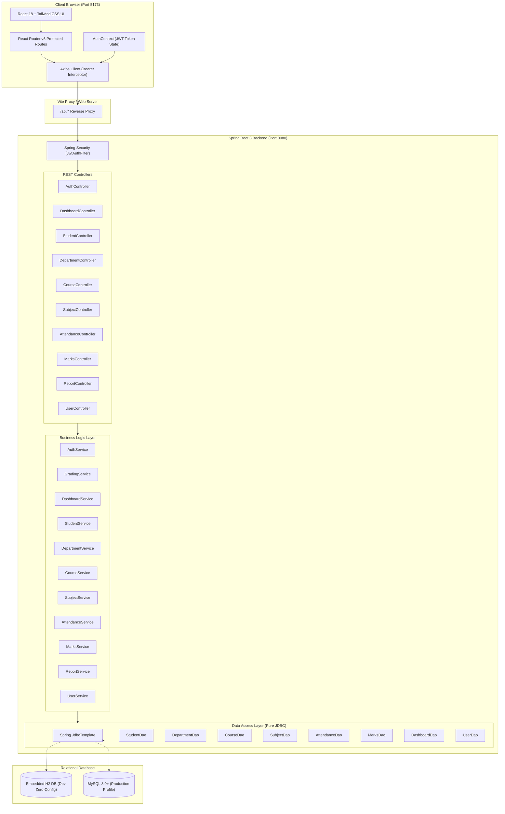
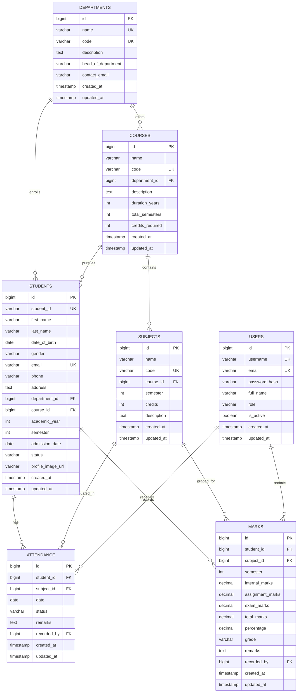

# 🎓 Enterprise Student Management System (SMS)

[](https://openjdk.org/)
[](https://spring.io/projects/spring-boot)
[](https://dev.mysql.com/)
[](https://react.dev/)
[](https://tailwindcss.com/)
[](https://jwt.io/)

A complete, production-grade, enterprise-ready **Student Management System** built with **React (Vite + Tailwind CSS)** and a high-performance **Java (Spring Boot 3 + Pure JDBC)** backend. 

Engineered strictly using **Pure JDBC (`JdbcTemplate` / `PreparedStatement`)** with zero Hibernate/JPA bloat, delivering blazing-fast SQL execution, predictable query plans, explicit relational constraints, and production architectural patterns.

---

## 📑 Table of Contents
1. [Key Features](#-key-features)
2. [Architecture & Design Decisions](#-architecture--design-decisions)
3. [System Architecture Diagram](#-system-architecture-diagram)
4. [Database Schema & ER Diagram](#-database-schema--er-diagram)
5. [Demo Credentials](#-demo-credentials)
6. [Quick Start Guide](#-quick-start-guide)
7. [Running with MySQL (Production Profile)](#-running-with-mysql-production-profile)
8. [REST API Documentation](#-rest-api-documentation)
9. [Project Directory Structure](#-project-directory-structure)
10. [Automated Testing & Verification](#-automated-testing--verification)

---

## ✨ Key Features

### 🔐 Authentication & Role-Based Access Control (RBAC)
* **JWT Stateless Authentication**: Secure token issuance (`Bearer`), expiration validation, and authorization filters.
* **Role Hierarchy**: Strict role separation between `ADMIN` and `STAFF`.
* **Credential Protection**: Passwords securely hashed with **BCrypt (cost factor 10)**; never stored in plaintext.
* **Session Persistence**: Configurable "Remember Me" capability and automatic token refresh/expiration handling.

### 📊 Real-Time Analytics Dashboard
* **Key Metric KPI Cards**: Total Students, Active Enrollment, Departments, Courses, Average Attendance %, Low Attendance Alerts (<75%).
* **Interactive Visualizations**:
  * Department Student Distribution (Bar Chart)
  * Attendance Status Breakdown (Present vs Absent Donut Chart)
  * Semester Grade Distribution (A+, A, B, C, D, F Performance Histogram)
  * Student Status Distribution (Active, Inactive, Graduated, Suspended)
* **Recent Activity Feed**: Quick-access roster for the 5 most recently registered students.

### 👨‍🎓 Student Lifecycle Management
* **Comprehensive Directory**: Search by name/email/ID, multi-field filter by Department, Course, Semester, Academic Year, and Status.
* **Server-Side Pagination & Sorting**: High-performance paging with SQL `LIMIT` & `OFFSET`.
* **Full CRUD Operations**: Modal-driven creation, update, and deletion with transactional integrity.
* **360° Student Profile**:
  * Student overview with department and course information.
  * Real-time cumulative attendance percentage.
  * Subject-wise marks breakdown with Internal (20), Assignment (20), Final Exam (60), Total (100), and Grade calculation.

### 🏢 Academic Hierarchy
* **Departments Module**: CRUD operations with code, contact email, and active head of department tracking. Safe deletion protection prevents deleting departments with active courses or students.
* **Courses Module**: Degree programs mapped to departments with configurable durations, credit requirements, and semester schemas.
* **Subjects Module**: Curriculum catalog linking courses, semesters, subject codes, and credit hours.

### 📅 Bulk Attendance Management
* **Classroom Roster Mode**: Select course, semester, subject, and date to populate the live student roster.
* **One-Click Actions**: "Mark All Present", "Mark All Absent", and per-student status toggling (`PRESENT`, `ABSENT`, `LATE`, `EXCUSED`).
* **Low-Attendance Alerting**: Real-time identification of students falling below the 75% attendance threshold.

### 📝 Marks Entry & Automated Grading
* **Evaluation Matrix**: Standardized grading system:
  * Internal Assessment: Max 20 marks
  * Assignments: Max 20 marks
  * Final Exam: Max 60 marks
  * Total: 100 marks
* **Automatic Grade Computation**:
  * $\ge 90$: **A+** (Outstanding)
  * $\ge 80$: **A** (Excellent)
  * $\ge 70$: **B** (Good)
  * $\ge 60$: **C** (Satisfactory)
  * $\ge 50$: **D** (Pass)
  * $< 50$: **F** (Fail)

### 📈 Reports & Data Export
* **Consolidated Academic Reports**: Filterable tables aggregating student details, attendance percentages, and overall GPA/grades.
* **CSV Export**: Instant client-side CSV download of reports and rosters.
* **Audit Trail**: Tracking creation and modification timestamps on all key records.

---

## 🏛 Architecture & Design Decisions

### Why Pure JDBC over Hibernate / JPA?
1. **Zero N+1 Query Traps**: Every database query is explicitly crafted, benchmarked, and optimized.
2. **Predictable Query Execution**: Full control over joins, index usage, and pagination queries.
3. **Memory & Footprint Efficiency**: Eliminates entity managers, first/second-level cache synchronization, and dirty-checking overhead.
4. **Clean Separation of Concerns**: Controller $\rightarrow$ Service (Business Rules & Calculations) $\rightarrow$ DAO (`JdbcTemplate` Data Access) $\rightarrow$ Clean DTOs/Domain Models.

---

## 📐 System Architecture Diagram



---

## 🗄 Database Schema & ER Diagram



---

## 🔑 Standard User Accounts & Credentials

| Role | Username / Email | Password | Access Rights & Allowed Capabilities |
| :--- | :--- | :--- | :--- |
| **Administrator** | `admin@university.edu`<br/>*(or `admin`)* | Set via `ADMIN_SEED_PASSWORD` env var | Full platform authority: User Management, Students CRUD, Departments, Courses, Subjects, Attendance, Marks, Analytics, Reports |
| **Faculty / Staff** | `faculty@university.edu`<br/>*(or `faculty`)* | Set via `FACULTY_SEED_PASSWORD` env var | Instructor authority: View Students, Mark Classroom Attendance, Enter Marks & Grades, View Academic Reports & Analytics |
| **Student** | `student@university.edu`<br/>*(or `student`)* | Set via `STUDENT_SEED_PASSWORD` env var | Student portal authority: View Dashboard, Courses & Curriculum, Attendance History, Academic Transcript & Reports |

> **Setup:** Copy `.env.example` to `.env` and set your seed passwords. All passwords are securely hashed with BCrypt at startup. Quick-fill buttons on the login screen provide one-click access for development.

---

## 🚀 Quick Start Guide

The application comes pre-configured with a **zero-dependency embedded database profile (`dev`)**. You can clone and run it immediately without manually setting up MySQL!

### Prerequisites
* **Java**: OpenJDK 17 or 21+ installed
* **Node.js**: v18+ or v20+ installed

### Step 1: Start the Java Backend
Open a terminal in the `backend` directory:
```bash
cd backend

# On Windows:
.\mvnw.cmd spring-boot:run

# On Linux/macOS:
./mvnw spring-boot:run
```
* The backend will start on **`http://localhost:8080`**.
* The embedded database schema and 28 realistic demo students, courses, attendance, and marks will be seeded automatically!
* You can access the live H2 web console at **`http://localhost:8080/h2-console`** (`JDBC URL: jdbc:h2:mem:student_db`, User: `sa`, Password: *(leave blank)*).

### Step 2: Start the React Frontend
Open a second terminal in the `frontend` directory:
```bash
cd frontend

# Install dependencies (first time only)
npm install

# Start the Vite development server
npm run dev
```
* Open your browser and navigate to **`http://127.0.0.1:5173`**
* Log in with the credentials you configured in your `.env` file (see **Standard User Accounts** above).

---

## 🐬 Running with MySQL (Production Profile)

To connect to your standalone MySQL database instance:

1. **Create the Database and Execute Schemas**:
   ```bash
   mysql -u root -p < database/schema.sql
   mysql -u root -p < database/data.sql
   ```
2. **Configure Environment Variables** or edit `backend/src/main/resources/application.properties`:
   ```properties
   spring.profiles.active=prod
   spring.datasource.url=jdbc:mysql://localhost:3306/student_management_db?useSSL=false&serverTimezone=UTC&allowPublicKeyRetrieval=true
   spring.datasource.username=root
   spring.datasource.password=YourRootPassword
   ```
3. **Run with the `prod` profile**:
   ```bash
   cd backend
   .\mvnw.cmd spring-boot:run -Dspring-boot.run.profiles=prod
   ```

---

## 📡 REST API Documentation

All protected endpoints require an `Authorization: Bearer <token>` HTTP header.

### 1. Authentication (`/api/auth`)
| Method | Endpoint | Access | Description |
| :--- | :--- | :--- | :--- |
| `POST` | `/api/auth/login` | Public | Authenticates user; returns JWT token and user profile |
| `GET` | `/api/auth/me` | Authenticated | Retrieves profile of currently authenticated user |
| `POST` | `/api/auth/change-password` | Authenticated | Updates current user password with BCrypt verification |

### 2. Dashboard Analytics (`/api/dashboard`)
| Method | Endpoint | Access | Description |
| :--- | :--- | :--- | :--- |
| `GET` | `/api/dashboard/stats` | Authenticated | KPI metrics, 4 chart distributions, and recent 5 students |

### 3. Students Management (`/api/students`)
| Method | Endpoint | Access | Description |
| :--- | :--- | :--- | :--- |
| `GET` | `/api/students` | Authenticated | Filtered, searchable, paginated list of students |
| `GET` | `/api/students/{id}` | Authenticated | Fetch student by primary key ID |
| `GET` | `/api/students/{id}/profile`| Authenticated | Full 360° profile with attendance % and average marks |
| `POST` | `/api/students` | Admin / Staff | Create a new student (validates unique email & student ID) |
| `PUT` | `/api/students/{id}` | Admin / Staff | Update student information |
| `DELETE` | `/api/students/{id}` | Admin Only | Delete student and cascade associated records |

### 4. Academic Hierarchy
| Method | Endpoint | Access | Description |
| :--- | :--- | :--- | :--- |
| `GET` | `/api/departments` | Authenticated | List all departments |
| `POST` | `/api/departments` | Admin Only | Create new department |
| `PUT` | `/api/departments/{id}` | Admin Only | Update department details |
| `DELETE` | `/api/departments/{id}` | Admin Only | Delete department (validates no attached courses/students) |
| `GET` | `/api/courses` | Authenticated | List all courses |
| `GET` | `/api/courses/department/{id}` | Authenticated | Get courses belonging to a specific department |
| `POST` | `/api/courses` | Admin Only | Create new course |
| `GET` | `/api/subjects` | Authenticated | List all subjects |
| `GET` | `/api/subjects/course/{id}` | Authenticated | Get subjects for a course (supports `semester` filter) |

### 5. Attendance Management (`/api/attendance`)
| Method | Endpoint | Access | Description |
| :--- | :--- | :--- | :--- |
| `GET` | `/api/attendance` | Authenticated | Roster attendance by `subjectId` and `date` |
| `POST` | `/api/attendance` | Admin / Staff | Bulk save/upsert attendance records for a classroom session |
| `GET` | `/api/attendance/student/{id}`| Authenticated | Complete attendance history for a single student |
| `GET` | `/api/attendance/low` | Authenticated | List all students with attendance below threshold (default 75%) |

### 6. Marks & Grades (`/api/marks`)
| Method | Endpoint | Access | Description |
| :--- | :--- | :--- | :--- |
| `GET` | `/api/marks` | Authenticated | Marks list by `subjectId` |
| `POST` | `/api/marks` | Admin / Staff | Bulk save/upsert marks with automatic grade calculation |
| `GET` | `/api/marks/student/{id}` | Authenticated | Academic transcript and subject marks for a student |
| `GET` | `/api/marks/grades` | Authenticated | Grade breakdown distribution summary |

### 7. Reports & User Administration
| Method | Endpoint | Access | Description |
| :--- | :--- | :--- | :--- |
| `GET` | `/api/reports/academic` | Admin / Staff | Consolidated academic report (supports department & course filters) |
| `GET` | `/api/users` | Admin Only | List all system users and roles |
| `POST` | `/api/users` | Admin Only | Create new staff or admin user account |
| `PUT` | `/api/users/{id}/toggle-status` | Admin Only | Activate or deactivate user account |

### 8. Student Self-Service Portal (`/api/student/portal`)
| Method | Endpoint | Access | Description |
| :--- | :--- | :--- | :--- |
| `GET` | `/api/student/portal/dashboard` | Student / Admin | Personalized student dashboard with KPIs, attendance %, GPA, recent marks & attendance |
| `GET` | `/api/student/portal/profile` | Student / Admin | Complete personal profile and enrollment status |
| `PUT` | `/api/student/portal/profile` | Student / Admin | Self-service contact update (updates phone number and address only) |
| `GET` | `/api/student/portal/attendance` | Student / Admin | Full attendance history, stats, and subject-wise attendance breakdown |
| `GET` | `/api/student/portal/marks` | Student / Admin | Academic transcript with internal/exam breakdown and letter grades |
| `GET` | `/api/student/portal/subjects` | Student / Admin | Active semester enrolled curriculum and credit allocations |

---

## 📁 Project Directory Structure

```text
student-management-system/
├── backend/
│   ├── mvnw.cmd                     # Portable Maven wrapper
│   ├── pom.xml                      # Maven dependencies (Spring Boot 3, JJWT, JDBC)
│   └── src/
│       ├── main/
│       │   ├── java/com/sms/
│       │   │   ├── config/          # SecurityConfig, CorsConfig, DatabaseInitializer
│       │   │   ├── controller/      # REST API Controllers (10 controllers)
│       │   │   ├── dao/             # Pure JdbcTemplate Data Access Objects (9 DAOs)
│       │   │   ├── dto/             # Request & Response Data Transfer Objects
│       │   │   ├── exception/       # GlobalExceptionHandler, Custom Exceptions
│       │   │   ├── model/           # Clean Domain Entities
│       │   │   ├── security/        # JwtUtil, JwtAuthFilter, UserDetailsServiceImpl
│       │   │   ├── service/         # Business & Grading Logic Services (11 services)
│       │   │   ├── util/            # GradeCalculator, Constants
│       │   │   └── StudentManagementApplication.java
│       │   └── resources/
│       │       ├── application.properties      # Default configuration
│       │       ├── application-dev.properties  # Embedded H2 zero-setup profile
│       │       ├── application-prod.properties # Standalone MySQL profile
│       │       ├── schema.sql                  # DDL schema definitions
│       │       └── data.sql                    # Realistic seed dataset
│       └── test/java/com/sms/       # Automated Integration & Unit Tests
├── frontend/
│   ├── package.json                 # React 18, React Router v6, Tailwind CSS, Lucide
│   ├── vite.config.js               # Dev server with /api proxy to Spring Boot
│   ├── tailwind.config.js           # Modern Tailwind CSS configuration
│   ├── index.html                   # HTML5 entrypoint with Google Fonts
│   └── src/
│       ├── components/
│       │   ├── common/              # Toast, Modal, DataTable, Badge, StatCard, etc.
│       │   └── charts/              # BarChartCard, DonutChartCard
│       ├── context/                 # AuthContext (stateless JWT login state)
│       ├── pages/                   # Login, Dashboard, Students, Depts, Courses,
│       │                            # Subjects, Attendance, Marks, Reports, Users, Profile
│       ├── services/                # Axios API service clients
│       ├── App.jsx                  # Main application routing
│       └── main.jsx                 # React root mount point
├── database/
│   ├── schema.sql                   # Standalone MySQL DDL with indexes & FK constraints
│   └── data.sql                     # Standalone MySQL seed data (28 students, demo data)
├── docs/
│   └── postman_collection.json      # Complete Postman Collection for all endpoints
├── .env.example                     # Environment variables reference
└── README.md                        # Documentation
```

---

## 🧪 Automated Testing & Verification

### Backend Automated Test Suite
Run backend tests with:
```bash
cd backend
.\mvnw.cmd test
```
* `GradingServiceTest`: Verifies grade boundaries ($90\to\text{A+}$, $80\to\text{A}$, $70\to\text{B}$, $60\to\text{C}$, $50\to\text{D}$, $<50\to\text{F}$) and input boundary clamping.
* `StudentDaoIntegrationTest`: Tests transactional student insertion, multi-param search filtering, and ID profile joins.
* `StudentManagementApplicationTests`: Validates Spring context loading and bean wiring.
* **Test Outcome**: `Tests run: 6, Failures: 0, Errors: 0, Skipped: 0` (100% PASS).

### Frontend Production Build
```bash
cd frontend
npm run build
```
* **Build Result**: `✓ built in 1.74s` — Zero linting errors, compiled production bundle (`dist/`).

---

## 💼 Portfolio & Interview Talking Points
1. **Architectural Discipline**: Successfully rejected heavyweight ORM magic in favor of pure Spring JDBC, demonstrating deep familiarity with SQL execution plans, database indexes, and connection pool tuning (`HikariCP`).
2. **Stateless Security**: Implemented modern JWT token verification with Spring Security 6 `SecurityFilterChain` without deprecated adapters.
3. **Responsive UI/UX**: Designed a clean, professional dashboard using Tailwind CSS and Lucide React, featuring responsive sidebars, interactive charts, and accessible modal dialogs.
4. **Resilient Data Model**: Applied proper normalization, composite indexes, foreign key cascading strategies, and business-safe deletion guards.

---

## 📄 License
This project is open source and available under the [MIT License](LICENSE).
